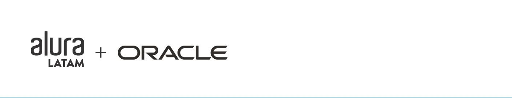

# challengeonedecodificador2

# Sobre

    O primeiro projeto/desafio proposto pela Alura em conjunto com ONE(Oracle Next Education).
    implementando ferramentas HTML5, CSS3, Java Script, com o objetivo de desenvolver uma
    lógica de criptografia, descriptografia onde substitui as vogais por frases aleatórias pre-definidas e um  botão de copiar para área de transferência.
    

 
    Nesse projeto fiz ao meu estilo, implementei um design que acho que tem a ver com o tema, onde ficou super interativo, fácil e didático para o usuário utilizar.

# Caracteristicas

- [x] Elemententos HTML semântico.
- [x] CSS BEM Estilo pixelado, Cyberpunk. Responsivo Desktop, Tablet e Smartphone.  
- [x] Algoritimo em JS para criptografar e descriptografar.
- [x] botão que copiar resultado para área de transferência.
- [x] animações

# Autor
Made for Lucas Martins </> [see my linkedIn](www.linkedin.com/in/lucas-martins-desenvolvedor)
